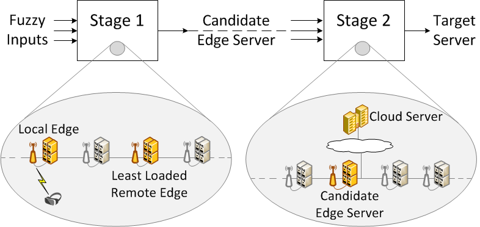

# Adhoc Thesis Offloading with reliable security 

This application includes the source code which is submitted for the final year thesis project for the course MSc Cloud Computing.

## Fuzzy Logic Based Workload Orchestrator

In this application we introduce a fuzzy logic based workload orchestrator with adhoc devices. In our design, two stage fuzzy logic system is used as shown in Figure 1. In the first stage, the most convenient edge server in the edge layer is found. In the second stage, the candidate edge server and the cloud server are compared. As a result of these operations, the proposed fuzzy logic based workload orchestrator finds a target server which can be the local edge server, remote edge server or the cloud server. Additionally, for the adhoc devices it will Check for the latest operating system for offloading secured applications. In other words, adhoc host will be selected only when the version is latest otherwise it will skip.

  
  

    Figure 1: Two stage fuzzy workload orchestration.
  

## Why Fuzzy Logic

* Computation offloading is NP-Hard with many inputs and output variables
* Fuzzy logic easily handles multi-constraint optimization process
* There is no simple decision model for offloading
* Fuzzy logic lets us handle the uncertainty with simple if-then rules
* Fuzzy logic abstracts complex operational details in a high level human understandable format

## Simulated Environment

A health application offloading is simulated in this application. The individuals are assumed to carry and/or wear the mobile gadgets which continuously run applications that in turn create a traffic due to offloading of the tasks. There exists certain number of edge servers located in the desired location such that they provide coverage for edge computing requests. A user is connected to the nearest edge server via WLAN whereas the edge servers are interconnected by MAN. Also, the standard cloud infrastructure can be accessed over WAN. In this setting, it is possible for the user to offload a task to (i) Nearest edge server (we call this the local edge server) (ii) a neighboring edge server connected by AN (we call this the remote edge server), and (iii) to the global cloud servers. In our work, this decision is handled by the workload orchestrator.

## References
**[1]** C. Sonmez, A. Ozgovde and C. Ersoy, "[Fuzzy Workload Orchestration for Edge Computing](https://ieeexplore.ieee.org/abstract/document/8651335/)," in *IEEE Transactions on Network and Service Management*, vol. 16, no. 2, pp. 769-782, June 2019.
